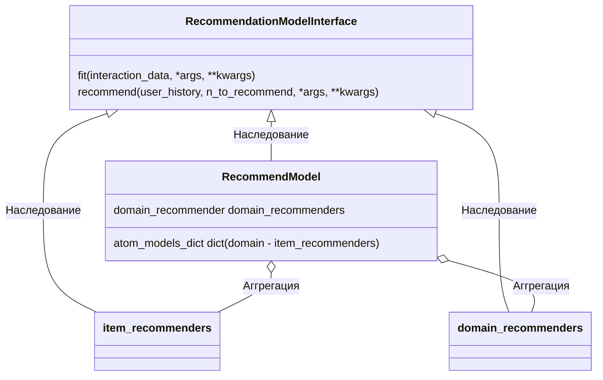
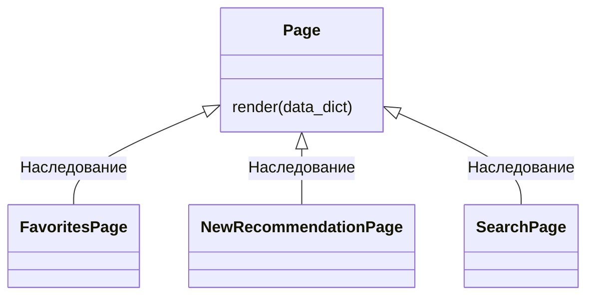

# Техническая документация проекта MFDP-RecSys

1. [Запуск сервиса](#app_runing)
2. [Взаимодействие компонент](#components)

## <a name="app_runing">1. Запуск сервиса</a> 

### 1.1 Запуск на локальной машине

1. Создание окружения и установка зависимостей: 

В cmd прописать из-под */MFDP-RecSys*:

`conda create -n mfdp_env`

`conda activate mfdp_env`

`pip install -r requirements.txt`

Я решил остановиться на классическом pip, потому что он простой и понятный и streamlit работает с ним лучше

С установкой зависимостей не должно быть трудностей (разве что implicit и lightfm могут поругаться на windows)

2. Запуск приложения streamlit

Для локального запуска прописать в cmd:

`streamlit run main.py`

И перейти по указанному в командной строке адресу. У меня это http://localhost:8501

### 1.2 Запуск через Docker

0. Проверить, запущен ли docker:

В cmd прописать команду `docker`

1. Создание образа контейнера из Dockerfile

В cmd прописать:

`docker build --tag mfdp-recsys .`

Дождаться создания образа. Проверить его наличие с помощью `docker images`

2. Запуск контейнера

В cmd прописать:

`docker run -p 8501:8501 mfdp-recsys`

И перейти по указанному в командной строке адресу. У меня это http://localhost:8501

**Комментарии:**

Образ получается примерно 2 ГБ, что слишком много. Я понимаю, что лучше бы настроить, чтобы в образе был только код, а модели тянулись из тома, подключенного к этому образу. 
Это сделало бы и образ легче и обновление моделей было бы менее сложным и для этого бы не требовалось пересобирать образ. 
Но streamlit cloud предпологает работу с монолитным приложением или хранение моделей на другом хостинге и общение с ними через API. 
Понятно, что это более здоровый способ, но более затратный в плане ресурсов и времени. Поэтому такое монолитное решение это не ошибка архитектуры (хотя от части это так), а осознонное решение.
Мне самому это не очень нравится, и в будущем это надо исправить. 

### 1.3 Изменения на сервере Streamlit Cloud

Streamlit Cloud предлогает свой довольно удобный хостинг для приложений (со многими ограничениями, но для быстрого решения очень хорошо подходит)
На этом сервере уже настроены хуки на main ветку данного репозитория, поэтому любой пуш в main будет приводить к изменениям на сервере, что очень удобно для дебага!
(Но лучше перед пушем проверить все локально)

## <a name="components">2. Взаимодействие компонент</a> 

### 2.1 Взаимодействие ML компонентов

Здесь я еще раз опишу предпологаемую схему взаимодействия классов моделей, но уже с красивыми схемами. 

Есть один общий абстрактный класс RecommendationModelInterface, который определяет интерфейс всех моделей и 3 типа его подклассов:
1. Классы для рекомендации item: TopRecommender, CosineDistanceRecommender, ALSBasedRecommender, LightFMBasedRecommender, TagsBasedRecommender

Они обучаются на раздельных датасетах и рекомендуют только в рамках своего domain

2. Классы для рекомендации домена: PopularDomainRecommender, AdaptiveDomainRecommender

Они решают какой домен порекомендовать на какой позиции. По факту определяют сколько каждого из доменов будет в рекомендации

3. Мета-класс для рекомендации по нескольким доменам: RecommendModel

Формирует окончательную рекомендацию.

Схема взаимодействия классов (Надеюсь не накосячил и более менее понятно отрисовал. Я только потихоньку учу паттерны):

### 2.2 Работа frontend компонентов

Каждая страничка реализована как отдельный класс с методом .render, который отрисовывает необходимую страничку такой, как нужно. Схема:

Каждый из классов создается единожды при инициализации странички. 

NewRecommendationPage при создании загружает модели из памяти.

Затем на sidebar (объект класса Sidebar) выбирается страничка, которая затем отрисовывается с помощью метода .render

**Немного про аутентификацию**

Перед отрисовкой страницы появляется аутентицикация. 

Это один класс Authenticate, в котором реализовано два метода - Вход и Регистрация. В зависимости от того, какой вариант выбран на sidebar регистрации (отдельный объект класса Sidebar), отлбражается либо окно регистрации, либо окно входа.

Логины, пароли и избранное хранится в импровизированной БД, состоящей из yaml файлика (Опять же не нормальная БД, а yaml файл потому что есть требование к монолитности данного решения). Доступа к этому файлику при работе из контейнера нет, поэтому все более менее безопасно (чуть позже добавлю хэширование, чтобы совсем безопасно)

